# kottans-frontend
## Linux CLI, and HTTP  

* Command line is cool! Who needs UI?
* Need more info about HTTP

## Git collaboration  
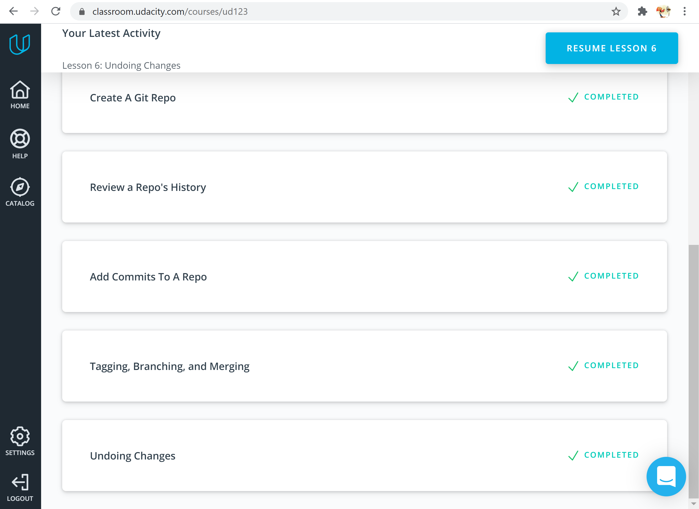

- So powerful git is!
- Great courses, collaboration via GitHub is clear now. It was interesting

## Intro to HTML and CSS  
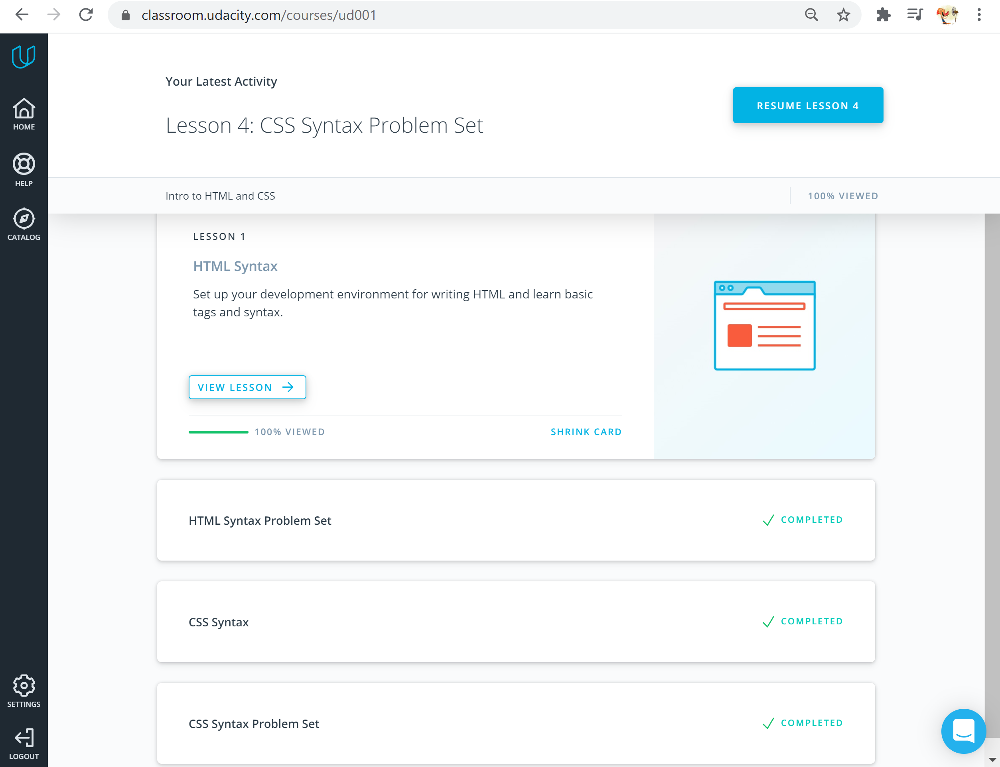
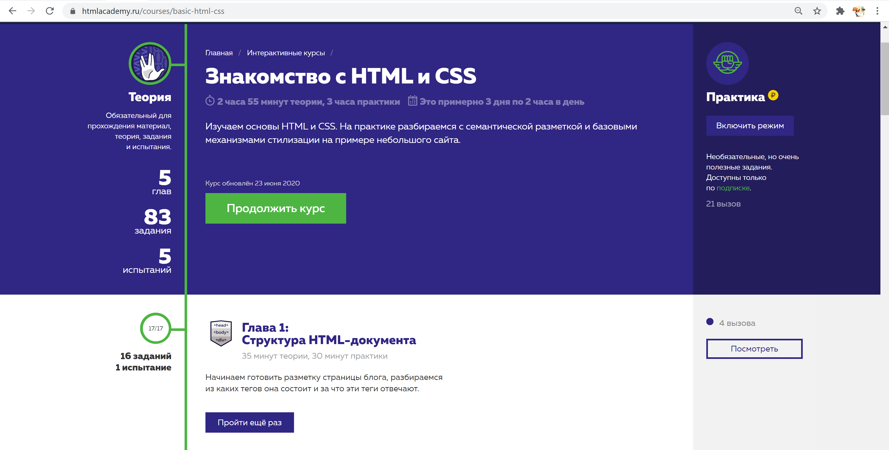
* I liked HTML and CSS
* Need more practice

## Responsive Web Design  
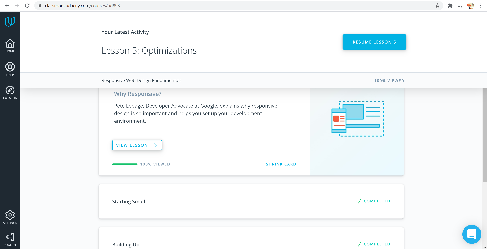
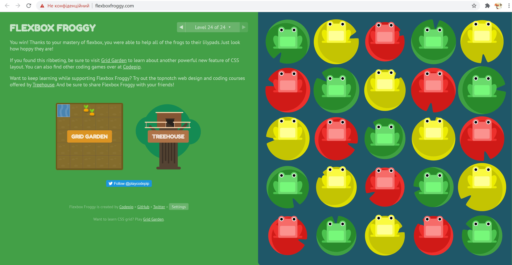
- Media query, breakpoints
- Common responsive patterns: column drop, mostly fluid, layout shifter, off canvas
- Responsive tables
- Grid
- Use: relative units, font-boosting, common sense

## JS Basics
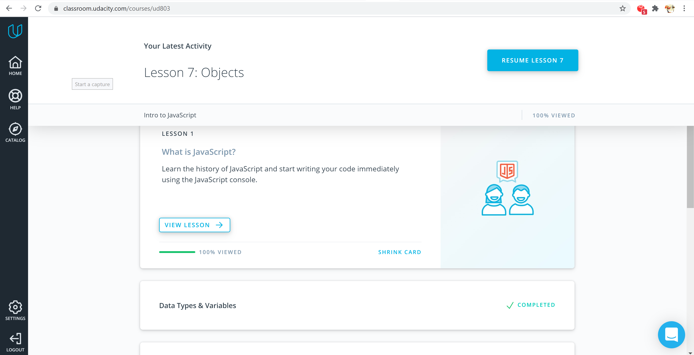
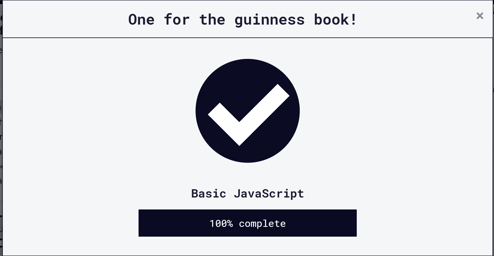
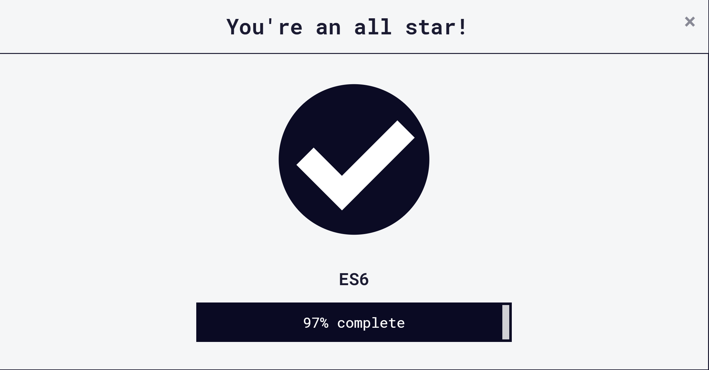
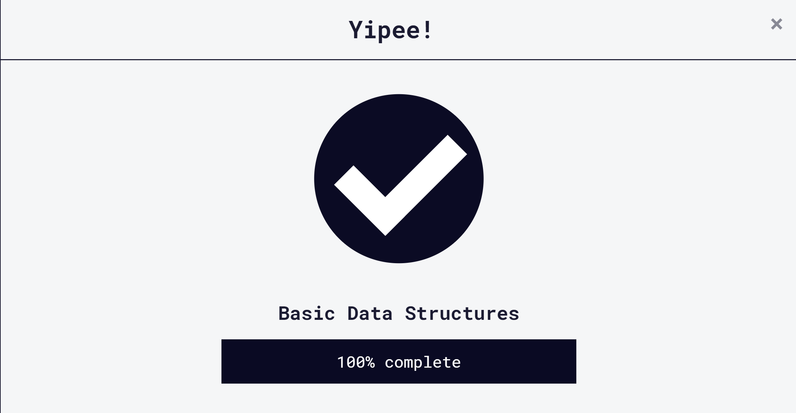
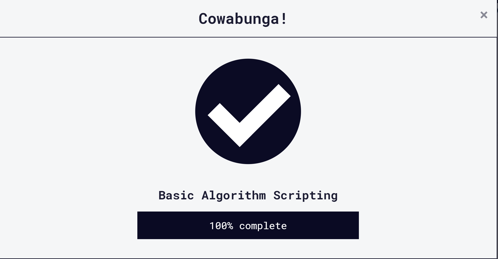
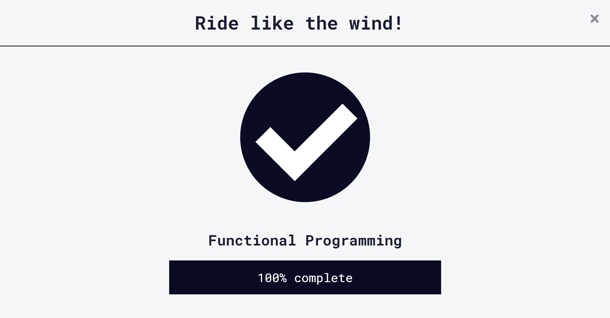
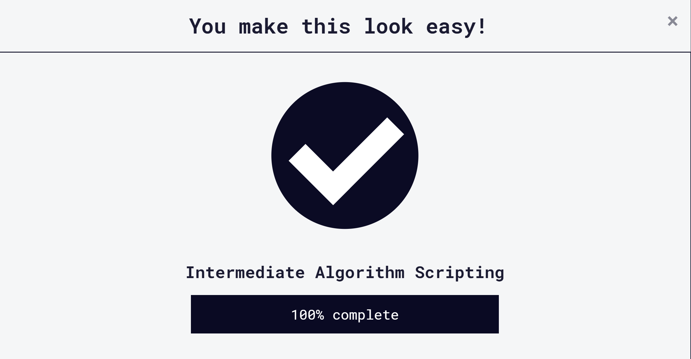
* JS - loosely typed programming language
* Data types: boolean, null, undefined, number, string, symbol and Object
* Object, Object and Object again
* Logical operators, switch, loops
* Functions, powerful and complicated
* Variables
* Functional programming: pure, isolated functions, avoid mutations and side effects, always declare dependencies and stay calm!
